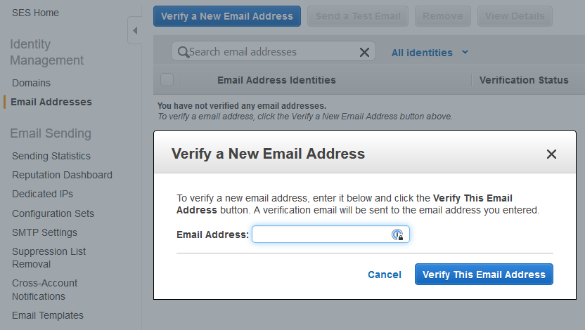
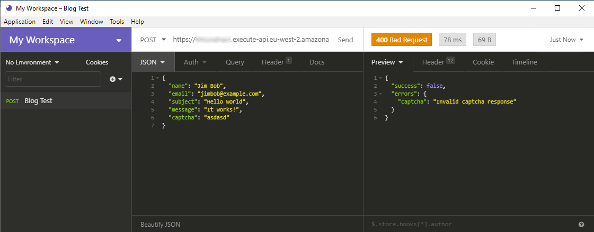

In this article we're going to implement a simple contact form using the Serverless framework, AWS Lambda and SES.
We'll also be throwing in some simple validation as well as spam prevention with reCAPTCHA.

## Prerequisites

This article assumes, you already have the [Serverless Framework](https://www.serverless.com/framework/docs/providers/aws/guide/quick-start/)
installed and your environment configured with [AWS credentials](https://www.serverless.com/framework/docs/providers/aws/guide/credentials/).

We'll also be using the following Serverless plugins:
- [Dotenv](https://www.serverless.com/plugins/serverless-dotenv-plugin)
- [Python Requirements](https://www.serverless.com/blog/serverless-python-packaging)

Our lambda will be written in Python 3 and we'll also be using [virtualenv](https://docs.python-guide.org/dev/virtualenvs/#lower-level-virtualenv)
and the [AWS SDK for Python](https://github.com/boto/boto3).

As we're using [reCAPTCHA](https://www.google.com/recaptcha/admin), you should have an appropriate site set-up already
and have the site and secret keys handy. If you'll be using `localhost` as a development server for the form, you'll
need to make sure that's listed in the allowed domains.

## First Steps - Email Verification with SES

In order to prevent fraud and abuse, SES will only let you send emails from verified addresses.
Fortunately verifying an email address is a very simple process:

- Log in to the AWS Console and open the SES service (make sure you're in the correct region)
- Select Email Addresses under Identity Management from the left-hand menu
- Click the big blue "Verify a New Email Address" button

<figure class="image is-fullwidth">
    
</figure>

Once you've entered the email address you'll be using and submitted the form, you'll receive a verification
email in your inbox, simply click the link in that email, and presto!

### The SES Sandbox

All new SES accounts are placed in a sandbox; which limits the number of messages you can send in a 24 hours period (200)
and also only allows you to send _to_ verified emails address as well as _from_.

You can [request that your account be removed from the sandbox](https://docs.aws.amazon.com/ses/latest/DeveloperGuide/request-production-access.html);
or alternatively, verify the email address that you'll be sending the contact form data _to_ (if it's different from the
one you verified earlier).


## Going Serverless

Now that we have our email addresses verified, it's time to create our Serverless service and install the plugins we'll need:

```bash
$ mkdir contact-form
$ sls create --template aws-python3
$ sls plugin install --name serverless-dotenv-plugin
$ sls plugin install --name serverless-python-requirements
```

Next we'll need to update the `serverless.yml` file:

```yaml
service: contact-form

provider:
  name: aws
  runtime: python3.8

  # we'll get these values from our .env file
  stage: ${env:STAGE}
  region: ${env:AWS_REGION}

  # this provides our Lambda with permission to use the SendEmail function of SES
  # https://www.serverless.com/blog/abcs-of-iam-permissions
  # https://www.serverless.com/framework/docs/providers/aws/guide/iam/
  iamRoleStatements:
    - Effect: Allow
      Action:
        - ses:SendEmail
      Resource: "*"

  # this is our reCAPTCHA secret key provided by Google
  # we'll obtain the correct value from our .env file
  environment:
    RECAPTCHA_SECRET: ${env:RECAPTCHA_SECRET}

functions:
  sendEmail:
    handler: handler.sendEmail
    description: Send an email based on data from a contact form
    events:
      - http:
          path: contact
          method: post
          cors: true

plugins:
  - serverless-dotenv-plugin
  - serverless-python-requirements
```

### Environment Configuration

As you probably noticed, we obtain several pieces of information from the environment, rather than specifying them
directly in the service definition file; so let's set-up those values now...

Create a file called `.env` in the root of the project directory and add the following (changing the values to suit):

```bash
STAGE=dev
REGION=eu-west-2
RECAPTCHA_SECRET=YOUR_SECRET_HERE
EMAIL_SOURCE=YOUR_VERIFIED_SOURCE_EMAIL
EMAIL_RECIPIENT=YOUR_VERIFIED_RECIPIENT_EMAIL
```

`EMAIL_SOURCE` is the verified email address that will appear in the `From` header.
`EMAIL_RECIPIENT` is the verified email address that the form submission will be emailed to.

I like to use different addresses for clarity - i.e. I can see that the email originated from the contact form,
but you can use the same address for both without issue.

## Writing the Lambda

Before we write the body of our lambda, lets create a virtual environment and install our dependencies:

```bash
$ virtualenv -p /usr/bin/python3 venv
$ source venv/bin/activate
$ pip install boto3 requests
```

Now we're ready to write our lambda:

```python

import os
import re
import json
import boto3
import requests

SUCCESS      = 200
CLIENT_ERROR = 400
SERVER_ERROR = 500

def sendEmail( event, context ):

    # send our event data to CloudWatch Logs for debugging
    print(event)

    # decode the JSON we received in the body of the request
    body = json.loads(event['body'])

    # create a data structure that articulates the data we're expecting
    # and populate it from the request body
    data = {
        'name': body.get('name'),
        'email': body.get('email'),
        'subject': body.get('subject'),
        'message': body.get('message'),
        'captcha': body.get('captcha'),
    }

    try:
        errors = validate(data)

    except ValueError as e:
        # this should only be an issue from reCAPTCHA,
        # so tell the client we couldn't process their request
        print('Validation Error', e)
        return response(SERVER_ERROR)

    if errors:
        # validate failed so tell the client
        return response(CLIENT_ERROR, errors)

    try:

        client = boto3.client('ses' )

        client.send_email(
            Source="%s <%s>" % (data['name'], os.environ.get('EMAIL_SOURCE')),
            Destination={
                'ToAddresses': [os.environ.get('EMAIL_RECIPIENT')]
                },
            ReplyToAddresses=["%s <%s>" % (data['name'], data['email'])],
            Message={
                'Body': {
                    'Text': {
                        'Charset': 'UTF-8',
                        'Data': data['message'],
                    },
                },
                'Subject': {
                    'Charset': 'UTF-8',
                    'Data': data['subject'],
                },
            },
        )

    except (ClientError, ParamValidationError) as e:
        print('SES Error', e)
        return response(SERVER_ERROR)

    return response(SUCCESS)


def validate( data ):

    errors = {}

    # all the items in our data structure must have a value when leading and trailing whitespace is removed
    for k, v in data.items():
        v = '' if v is None else str(v).strip()
        if not v:
            errors[k] = 'This is a required field'

    # very basic regex validation for email address
    if not errors.get('email') and not re.match("^[^@]+@[^@]+\.[^@.]+$", data['email']):
        errors['email'] = 'Invalid email address'

    # only do captcha validation if no other errors as we can only validate it once
    if not errors and not validateCaptcha(data['captcha']):
        errors['captcha'] = 'Invalid captcha response'

    return errors

def validateCaptcha( captchaResponse ):

    response = requests.post(
        'https://www.google.com/recaptcha/api/siteverify',
        data = {
            'secret': os.environ.get('RECAPTCHA_SECRET'),
            'response': captchaResponse,
        }
    )

    if not response.ok:
        return False

    data = response.json()

    print('Captcha Response', data)

    return data['success']


def response( statusCode, errors = None ):

    body = {
        'success': True if statusCode == SUCCESS else False,
    }

    if errors is not None:
        body['errors'] = errors

    return {
        'statusCode': statusCode,
        'body': json.dumps(body),
        'headers': {
            'Content-Type': 'application/json',
            'Access-Control-Allow-Origin': '*',
        },
    }
```

To summarise the actions performed in the code:
- Extract the data we need from the body of the incoming request
- Validate the data
  - All values are required (including removing of leading and trailing whitespace)
  - Basic email address validation
  - Make a call to the reCAPTCHA API to verify the response we received to the CAPTCHA
- If validation was passed, make a call to SES to send the email with the supplied data
- Respond with a JSON body indicating success and an optional `errors` object listing any validation errors

Calls to `print()` are automatically output to CloudWatch logs which is very handy for debugging as we'll see in a moment.

Now we have a working handler we can deploy our service and test it:

```bash
$ sls deploy
Serverless: DOTENV: Loading environment variables from .env:
Serverless: 	 - STAGE
Serverless: 	 - REGION
Serverless: 	 - RECAPTCHA_SECRET
Serverless: 	 - EMAIL_SOURCE
Serverless: 	 - EMAIL_RECIPIENT
<snip>
.................................
Serverless: Stack update finished...
Service Information
service: contact-form
stage: dev
region: eu-west-2
stack: contact-form-dev
resources: 12
api keys:
  None
endpoints:
  POST - https://<ID>.execute-api.eu-west-2.amazonaws.com/dev/contact
functions:
  sendEmail: contact-form-dev-sendEmail
layers:
  None
Serverless: Run the "serverless" command to setup monitoring, troubleshooting and testing.
```

We can test the handler logic by sending requests to the URL listed under `endpoints` in the output above.
I use [Insomnia](https://insomnia.rest/) as my API client but there's a multitude of other options.
Construct a JSON POST request such as the following and send it:

<figure class="image is-fullwidth">
    
</figure>

You should receive an "Invalid captcha response error" as we didn't supply valid reCAPTCHA data.

### Troubleshooting


## The Contact Form

The final piece of the puzzle is a contact form to show the user and handle the form submission. As our Serverless
service speaks JSON, you'll need some Javascript to handle the actual form submission and responses, otherwise your
users will just see the raw JSON response from the service.

Here's an example contact form in a single file that you can host via a simple `localhost` development server.
It uses [Bulma](https://bulma.io/), [Font Awesome](https://fontawesome.com/), [Cash](https://kenwheeler.github.io/cash/)
and makes use of the [Fetch API](https://developer.mozilla.org/en-US/docs/Web/API/Fetch_API) for request/response handling.

You'll need to replace the `<YOUR SERVICE ENDPOINT URL>` and `<YOUR RECAPTCHA SITE KEY>` placeholders with appropriate
values.

```html
<!doctype html>
<html lang="en">
<head>
  <meta charset="utf-8">
  <meta name="viewport" content="width=device-width, initial-scale=1, shrink-to-fit=no">
  <title>Contact Form Demo</title>
  <link rel="stylesheet" href="https://cdnjs.cloudflare.com/ajax/libs/font-awesome/5.13.0/css/all.min.css" integrity="sha256-h20CPZ0QyXlBuAw7A+KluUYx/3pK+c7lYEpqLTlxjYQ=" crossorigin="anonymous" />
  <link rel="stylesheet" href="https://cdnjs.cloudflare.com/ajax/libs/bulma/0.9.0/css/bulma.min.css" integrity="sha512-ADrqa2PY1TZtb/MoLZIZu/Z/LlPaWQeDMBV73EMwjGam43/JJ5fqW38Rq8LJOVGCDfrJeOMS3Q/wRUVzW5DkjQ==" crossorigin="anonymous" />
  <style>
    #contact-form .message {
      display: none;
    }
  </style>
</head>
<body>
  <main>
    <div class="container">
      <article class="static">
        <h1 class="title">Contact Form</h1>
        <form id="contact-form" action="<YOUR SERVICE ENDPOINT URL>" method="POST">
          <div class="columns">
            <div class="column">
              <div class="field">
                <label class="label">Your name</label>
                <div class="control has-icons-left">
                  <input id="contact-name" class="input" type="text" placeholder="">
                  <span class="icon is-small is-left">
                    <i class="fas fa-user"></i>
                  </span>
                </div>
                <p class="help is-danger"></p>
              </div>
            </div>
            <div class="column">
              <div class="field">
                <label class="label">Your email</label>
                <div class="control has-icons-left">
                  <input id="contact-email" class="input" type="email" placeholder="">
                  <span class="icon is-small is-left">
                    <i class="fas fa-envelope"></i>
                  </span>
                </div>
                <p class="help is-danger"></p>
              </div>
            </div>
          </div>
          <div class="field">
            <label class="label">Subject</label>
            <div class="control">
                <input id="contact-subject" class="input" type="text" placeholder="">
            </div>
            <p class="help is-danger"></p>
          </div>
          <div class="field">
            <label class="label">Message</label>
            <div class="control">
              <textarea id="contact-message" class="textarea" placeholder=""></textarea>
            </div>
            <p class="help is-danger"></p>
          </div>
          <div class="field captcha">
            <div class="g-recaptcha" data-sitekey="<YOUR RECAPTCHA SITE KEY>"></div>
            <p class="help is-danger" id="captcha-error"></p>
          </div>
          <div class="buttons">
            <button type="submit" class="button is-success">Send Message</button>
          </div>
          <div class="message is-danger">
            <div class="message-body">
              <span class="icon">
                  <i class="far fa-frown"></i>
              </span>
              Sorry, it seems that an error occurred. Please try again later...
            </div>
          </div>
          <div class="message is-success">
            <div class="message-body">
              <span class="icon">
                  <i class="far fa-smile"></i>
              </span>
              Success! Check your inbox...
            </div>
          </div>
        </form>
      <script src="https://www.google.com/recaptcha/api.js" async defer></script>
    </article>
    </div>
  </main>
  <script src="https://cdnjs.cloudflare.com/ajax/libs/cash/7.0.1/cash.min.js" integrity="sha256-cP4vwprtrs4i6th5S3ysmrRUfhdEyHA5MlBxaOwQ+/s=" crossorigin="anonymous"></script>
  <script>
$('#contact-form').on('submit', function( e ) {

  // reset form state
  $('#contact-form input').removeClass('is-danger');
  $('#contact-form textarea').removeClass('is-danger');
  $('#contact-form .help').hide();
  $('#contact-form .message').hide();

  // disable submit button and show wait status indicators
  $('#contact-form button[type=submit]').prop('disabled', true).addClass('is-loading');
  $('body').css('cursor', 'wait');

  fetch(
      $(e.target).attr('action'),
      {
          method: 'POST',
          headers: {
              'Content-Type': 'application/json',
          },
          body: JSON.stringify({
              name: $('#contact-name').val(),
              email: $('#contact-email').val(),
              subject: $('#contact-subject').val(),
              message: $('#contact-message').val(),
              captcha: $('#g-recaptcha-response').val(),
          }),
      }
  )
  .then(response => {

      // if we get a successful response we'll just assume the message was sent
      if( response.ok ) {
          $('#contact-form .buttons').hide();
          $('#contact-form .message.is-success').show();
      }
      // validation error
      else if( response.status == 400 ) {

          // wait for the response body and then show the error messages
          response.json().then(data => {
              console.log(data);
              Object.entries(data.errors).forEach(([field, message]) => {
                  if( field == 'captcha' ) {
                      $('#captcha-error').text(message).show();
                      return;
                  }
                  $('#contact-' + field).addClass('is-danger');
                  $('#contact-' + field).parent().siblings('.help').text(message).show();
              });
          });

      }
      // server error
      else if( response.status == 500 ) {
          throw 'Server Error';
      }
      else {
          throw 'Unexpected Error';
      }

  })
  .catch(error => {
      console.error('Error:', error);
      $('#contact-form .message.is-danger').show();
  })
  .finally(() => {
      // clear wait status indicators
      $('#contact-form button').prop('disabled', false).removeClass('is-loading').trigger('blur');
      $('body').css({'cursor': 'auto'})
  })

  // don't execute the normal form submission handler
  e.preventDefault();
  e.stopPropagation();
  return false;

});
  </script>
</body>
</html>
```

## Summary and Next Steps

You should now have a working contact form implementation with some inspiration for future experiments.
